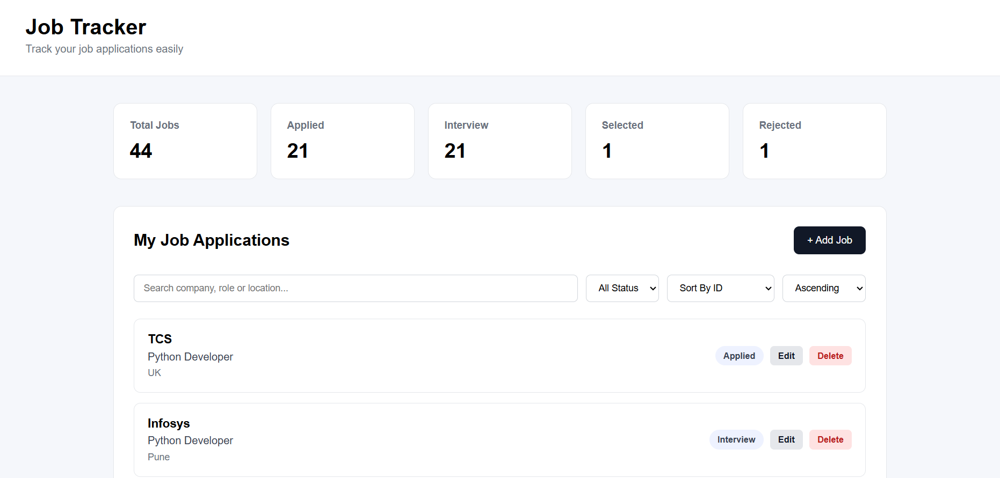
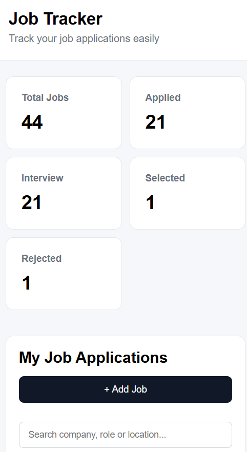

# Job Tracker

A full-stack web application to manage, track, and organize job applications.

The project provides a React frontend connected to a FastAPI backend and PostgreSQL database. It supports job application management, searching, filtering, sorting, pagination, statistics, and application-date tracking.

## 🚀 Features

### Job Management

- Add new job applications
- View job applications
- Edit existing job applications
- Delete job applications
- Track application date
- Track application status

### Search & Filtering

- Search jobs by company, role, or location
- Filter jobs by status
- Combine search and status filtering

### Sorting & Pagination

- Sort jobs by company, role, status, or ID
- Sort in ascending or descending order
- Paginate job applications

### Dashboard

- Total job applications
- Applied applications
- Interview applications
- Selected applications
- Rejected applications

### User Experience

- Loading state
- Empty state
- No matching results state
- Error state with retry option
- Responsive design for desktop and mobile

### Backend & Testing

- REST API built with FastAPI
- PostgreSQL database
- SQLAlchemy ORM
- Pydantic validation
- Swagger/OpenAPI documentation
- Automated API testing with pytest
- Separate PostgreSQL test database

## 🛠️ Tech Stack

### Frontend

- React
- Vite
- JavaScript
- CSS

### Backend

- Python
- FastAPI
- SQLAlchemy
- Pydantic
- Uvicorn

### Database

- PostgreSQL

### Testing

- Pytest
- FastAPI TestClient

## 📁 Project Structure

```text
job-tracker/
│
├── backend/
│   ├── main.py
│   ├── database.py
│   ├── models.py
│   ├── schemas.py
│   ├── test_main.py
│   └── requirements.txt
│
├── frontend/
│   ├── src/
│   │   ├── App.jsx
│   │   ├── App.css
│   │   └── index.css
│   ├── package.json
│   └── ...
│
├── screenshots/
│   ├── dashboard-desktop.png
│   └── dashboard-mobile.png
│
├── .gitignore
└── README.md
```

> `.env`, `venv/`, `node_modules/`, `__pycache__/`, and other local/development files are excluded from Git using `.gitignore`.

## 📸 Screenshots

### Desktop Dashboard



### Mobile Responsive Dashboard



## 🔌 API Endpoints

| Method | Endpoint | Description |
|---|---|---|
| GET | `/` | Check API status |
| POST | `/jobs` | Create a job |
| GET | `/jobs` | Get jobs with filtering, searching, sorting, and pagination |
| GET | `/jobs/stats` | Get job application statistics |
| GET | `/jobs/{job_id}` | Get a job by ID |
| PUT | `/jobs/{job_id}` | Update a complete job |
| PATCH | `/jobs/{job_id}` | Partially update a job |
| DELETE | `/jobs/{job_id}` | Delete a job |

## 🗄️ Database

The application uses PostgreSQL to store job applications.

The `jobs` table contains:

- ID
- Company
- Role
- Location
- Status
- Application Date

## ⚙️ Setup

### Prerequisites

Make sure you have installed:

- Python
- Node.js
- PostgreSQL
- Git

### Backend Setup

Navigate to the backend directory:

```bash
cd backend
```

Create a virtual environment:

```bash
python -m venv venv
```

Activate the virtual environment on Windows:

```bash
venv\Scripts\activate
```

Install the required Python packages:

```bash
pip install -r requirements.txt
```

Create a `.env` file in the `backend` directory and configure your PostgreSQL database connection.

Start the FastAPI server:

```bash
uvicorn main:app --reload
```

Backend API:

```text
http://127.0.0.1:8000
```

Swagger documentation:

```text
http://127.0.0.1:8000/docs
```

### Frontend Setup

Open another terminal and navigate to the frontend:

```bash
cd frontend
```

Install dependencies:

```bash
npm install
```

Start the React development server:

```bash
npm run dev
```

Frontend:

```text
http://localhost:5173
```

## 🧪 Testing

Run the backend automated tests from the `backend` directory:

```bash
pytest -v
```

The project uses a separate PostgreSQL test database to keep automated tests isolated from the main application database.

Current automated test result:

```text
16 passed
```

## 🔍 API Testing

The backend API can also be tested using the built-in Swagger/OpenAPI interface:

```text
http://127.0.0.1:8000/docs
```

The API has been tested for:

- Create job
- Get jobs
- Get job by ID
- Update job
- Partial update
- Delete job
- Search
- Filtering
- Sorting
- Pagination
- Statistics
- Application date handling

## 🚀 Future Improvements

- Job application reminders
- Authentication and user accounts
- Cloud deployment
- Job portal integration
- Resume-to-job matching
- Advanced analytics
- Email notifications

## 👩‍💻 Author

**Priti Pokale**

Computer Engineering Graduate | DevOps & Automation Enthusiast